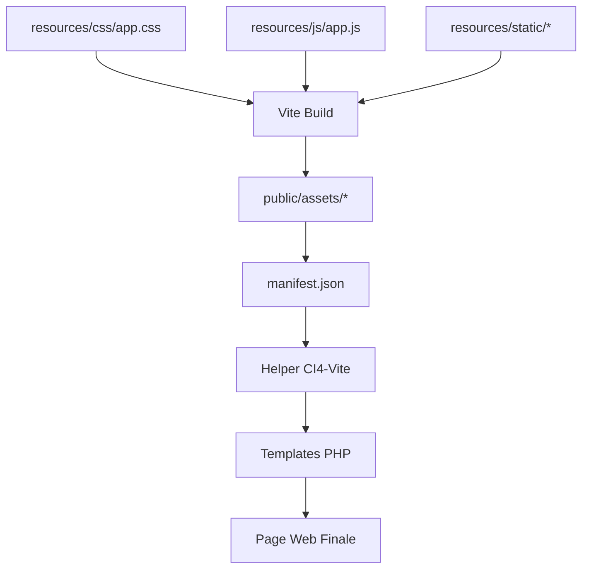

# 🚀 CI4 Tailwind Template v2.0 - Guide Complet

## ✨ Fonctionnalités Principales

- **🔧 Configuration Vite Optimisée** - Séparation CSS/JS, cache busting, HMR
- **🎨 Tailwind CSS Avancé** - Classes personnalisées, mode sombre, animations
- **⚡ Alpine.js Modulaire** - Composants réutilisables, interactivité moderne
- **🔗 Intégration CI4-Vite** - Helper robuste avec auto-détection dev/prod
- **📱 Landing Page Responsive** - Design moderne, multilingue (FR/EN)
- **🛠️ Outils de Développement** - Tests automatisés, monitoring performance

## 🚀 Démarrage Rapide

### **1. Test de Configuration Automatique**
```bash
# Windows
test-config.bat

# Résultat attendu:
# ✅ Build Vite réussi
# ✅ Séparation CSS/JS validée
# ✅ Helper CI4-Vite fonctionnel
```

### **2. Lancement du Projet**
```bash
# Mode développement complet (recommandé)
npm start
# ↳ Vite (localhost:5173) + CI4 (localhost:8080)

# Ou séparément
npm run dev    # Vite seulement
npm run serve  # CI4 seulement
```

### **3. Accès aux Pages**
- **🏠 Landing Page:** http://localhost:8080
- **🧪 Tests Config:** http://localhost:8080/test
- **⚡ Performance:** http://localhost:8080/test/performance

## 🏗️ Architecture du Projet

### **Structure Optimisée**
```
template/
├── 📁 app/
│   ├── Controllers/
│   │   ├── Home.php           # Landing page
│   │   └── Test.php           # Tests configuration
│   ├── Views/
│   │   ├── layouts/           # Templates CI4
│   │   │   ├── app.php        # Layout principal
│   │   │   ├── header.php     # Header avec Vite
│   │   │   └── footer.php     # Footer
│   │   ├── pages/
│   │   │   └── home.php       # Landing page optimisée
│   │   └── test/
│   │       ├── index.php      # Tests interactifs
│   │       └── performance.php # Monitoring
│   └── Helpers/
│       └── vite_helper.php    # Helper CI4-Vite
├── 📁 resources/
│   ├── css/
│   │   ├── app.css           # CSS principal + composants
│   │   └── variables.scss     # Variables SCSS
│   ├── js/
│   │   ├── app.js            # Point d'entrée JS
│   │   └── components/       # Composants Alpine.js
│   │       ├── darkMode.js   # Mode sombre
│   │       └── navbar.js     # Navigation
│   └── static/               # Assets sources
│       ├── images/           # Images → public/assets/images/
│       └── fonts/            # Fonts → public/assets/fonts/
├── 📁 public/
│   ├── assets/               # 🤖 Généré par Vite
│   │   ├── .vite/manifest.json # Mapping assets
│   │   ├── js/main.[hash].js   # JavaScript compilé
│   │   ├── css/app.[hash].css  # Tailwind compilé
│   │   ├── images/[hash]*      # Images optimisées
│   │   └── fonts/[hash]*       # Fonts avec cache
│   └── index.php             # Entry point CI4
├── 📄 vite.config.js         # Config Vite avancée
├── 📄 tailwind.config.js     # Config Tailwind custom
├── 📄 package.json           # Scripts npm optimisés
└── 📄 test-config.bat        # Test automatisé
```

### **Flux de Développement**


## ⚙️ Configuration Avancée

### **1. Vite Configuration**
```javascript
// vite.config.js - Points clés
export default defineConfig({
  publicDir: 'resources/static',
  build: {
    outDir: 'public/assets',
    manifest: true,
    rollupOptions: {
      input: {
        main: 'resources/js/app.js',     // JS principal
        styles: 'resources/css/app.css'  // CSS séparé
      }
    }
  }
});
```

### **2. Helper CI4-Vite**
```php
// Usage dans les templates
<?= vite_assets('resources/js/app.js', 'resources/css/app.css') ?>

// Preload des assets critiques
<?= vite_preload_assets(['resources/js/app.js']) ?>

// Mode développement auto-détecté
<?php if (vite_dev_server_running()): ?>
    <!-- Mode dev avec HMR -->
<?php endif; ?>
```

### **3. Tailwind CSS Personnalisé**
```css
/* app.css - Composants personnalisés */
@layer components {
  .btn {
    @apply inline-flex items-center px-6 py-3 rounded-lg transition-all;
  }
  .btn-primary {
    @apply bg-primary-600 text-white hover:bg-primary-700;
  }
  .card {
    @apply bg-white dark:bg-secondary-800 rounded-xl shadow-md;
  }
}
```

### **4. Alpine.js Modulaire**
```javascript
// app.js - Import des composants
import './components/darkMode.js';
import './components/navbar.js';

// components/darkMode.js
window.darkMode = () => ({
  isDark: false,
  toggle() { this.isDark = !this.isDark; }
});
```

## 🎨 Système de Design

### **Palette de Couleurs**
```javascript
// Couleurs personnalisées Tailwind
colors: {
  primary: {
    50: '#eff6ff',   500: '#3b82f6',   900: '#1e3a8a'
  },
  secondary: {
    50: '#f8fafc',   500: '#64748b',   900: '#0f172a'
  }
}
```

### **Composants CSS Disponibles**
- **Boutons:** `.btn`, `.btn-primary`, `.btn-secondary`, `.btn-outline`
- **Conteneurs:** `.container-custom`, `.section`, `.section-sm`
- **Cartes:** `.card`, `.card-hover`
- **Navigation:** `.nav-link`, `.nav-link-mobile`
- **Effets:** `.glass`, `.bg-gradient-primary`

### **Animations Incluses**
- **`.animate-fade-in`** - Apparition en fondu
- **`.animate-slide-up`** - Glissement vers le haut
- **`.animate-bounce-gentle`** - Rebond doux

## 📱 Landing Page Incluse

### **Sections Optimisées**
1. **Hero Section** - Animation, CTA, scroll indicator
2. **Projects Showcase** - Grille responsive, cartes interactives
3. **Technologies** - Stack technique avec icônes
4. **Call-to-Action** - Conversion optimisée

### **Fonctionnalités**
- **Mode sombre** automatique et manuel
- **Navigation responsive** avec menu mobile
- **Multilingue** (FR/EN) avec cookies
- **SEO optimisé** avec meta tags complets
- **Animations fluides** avec Alpine.js

## 🧪 Tests et Validation

### **Page de Tests (/test)**
- **Tests Tailwind CSS** - Couleurs, responsive, formulaires
- **Tests Alpine.js** - Compteur, modals, transitions
- **Status Configuration** - Vite, manifest, assets

### **Performance (/test/performance)**
- **Analyse Manifest** - Contenu, mapping assets
- **Métriques Build** - Tailles, optimisations
- **Serveur Vite** - Status dev server, HMR

### **Scripts de Test**
```bash
# Test complet automatisé
test-config.bat

# Build et vérification
npm run test:build

# Nettoyage assets
npm run clean
```

## 🚀 Déploiement Production

### **1. Build Optimisé**
```bash
# Build production avec optimisations
npm run build:prod

# Vérification des assets générés
ls public/assets/
```

### **2. Serveur Web**
```apache
# .htaccess - Cache et compression
<IfModule mod_expires.c>
    ExpiresActive On
    ExpiresByType text/css "access plus 1 year"
    ExpiresByType application/javascript "access plus 1 year"
    ExpiresByType image/* "access plus 1 year"
</IfModule>
```

### **3. Variables d'Environnement**
```php
// .env
CI_ENVIRONMENT = production
app.baseURL = 'https://votredomaine.com'
```

## 🔧 Maintenance et Évolution

### **Mise à Jour des Dépendances**
```bash
# Vérifier les mises à jour
npm outdated

# Mettre à jour Tailwind/Vite
npm update vite tailwindcss alpinejs

# Rebuild après mise à jour
npm run clean && npm run build
```

### **Ajout de Composants**
```javascript
// Nouveau composant Alpine.js
// resources/js/components/modal.js
window.modal = () => ({
  isOpen: false,
  open() { this.isOpen = true; },
  close() { this.isOpen = false; }
});
```

### **Extension Tailwind**
```css
/* Nouvelles classes personnalisées */
@layer components {
  .btn-gradient {
    @apply bg-gradient-to-r from-primary-500 to-primary-700;
  }
}
```

## 📚 Ressources et Support

### **Documentation**
- **[Vite.js](https://vitejs.dev/)** - Build tool moderne
- **[Tailwind CSS](https://tailwindcss.com/)** - Framework CSS utility-first
- **[Alpine.js](https://alpinejs.dev/)** - Framework JavaScript réactif
- **[CodeIgniter 4](https://codeigniter.com/)** - Framework PHP

### **Dépannage**
```bash
# Problème de build
npm run clean && npm install && npm run build

# CSS non appliqué
# Vérifier: tailwind.config.js content paths

# JS non fonctionnel  
# Vérifier: console navigateur (F12)

# Assets non trouvés
# Vérifier: public/assets/.vite/manifest.json
```

### **Support**
- 📧 **Email:** contact@it-innov.com
- 🔗 **GitHub:** Issues et discussions
- 📖 **Wiki:** Documentation détaillée

---

**🎉 Félicitations !** Vous avez maintenant un template CI4 + Tailwind CSS moderne, optimisé et prêt pour la production !
